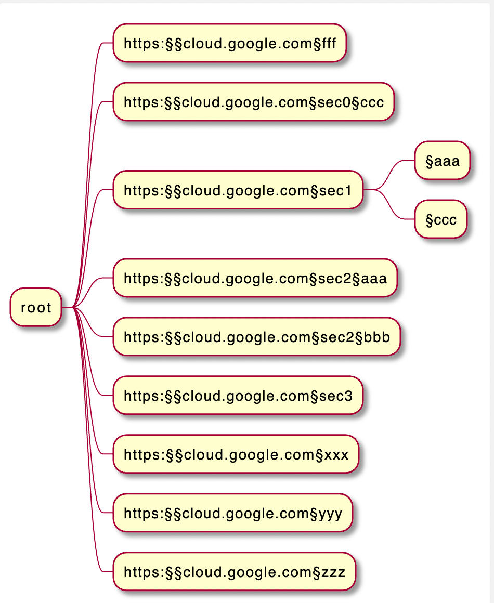

# 0to100

> 0 to 100 ... learn anything from webresources (and not)

## As user:

### 1st time usage: (manual) setup

- create a new folder and get 

```bash
wget -q https://raw.githubusercontent.com/obar1/0to100/main/setup.sh
```

- check latest tag values at https://github.com/obar1/0to100/tags

or if you have [lynx](https://simple.wikipedia.org/wiki/Lynx_(web_browser)) or similar installed

```bash
lynx -dump https://github.com/obar1/0to100/tags | grep tags | uniq | sort
```

- install :bowtie: the tag

```bash
bash setup.sh [tag] [target_dir]
```
> [target_dir] can be set to `.` to use the current folder 

- install req
> add/set env if you wish

```bash
pip install -r "0to100-latest/requirements.txt"
```

- check runme.sh

```bash
bash runme.sh help 
```

- optional get

```bash
wget -q https://raw.githubusercontent.com/obar1/0to100/main/test_setup/.gitignore
```

### daily usage:

-  create new section

```bash
url=https://cloud.google.com/docs
bash runme.sh create_section $url
url=https://cloud.google.com/help
bash runme.sh create_section $url
#...etc
```
-  refresh sections

```bash
bash runme.sh refresh_map
```
-  refresh links

```bash
bash runme.sh refresh_links
```
-  refresh puml

```bash
bash runme.sh refresh_puml
```


- help

```bash
bash runme.sh help
```


## As developer:

### Installation:

* Install Poetry: <https://python-poetry.org/docs/#installation>
* Install python env: `pyenv install 3.x`
* Install virtual env: `pyenv virtualenv 3.x zt1`
* Activate virtual env: `pyenv activate zt1`
* Install package and dependencies: `poetry install`
* Install pre-commit hooks: `poetry run pre-commit install`

### Run pre-commit hooks manually:

All pre-commit hooks will be run automatically when pushing changes.
They can also be run on staged files or on all files manually:

```bash
# Run all hooks against currently staged files,
# this is what pre-commit runs by default when committing:
pre-commit run

# Run all the hooks against all the files:
pre-commit run --all-files

# Run a specific hook against all staged files:
pre-commit run black
pre-commit run flake8
pre-commit run isort
pre-commit run pylint
```

### Export to pip req

so you can just use pip  to run the thing ...

```bash
poetry export -f requirements.txt --output requirements.txt --without-hashes  
```
